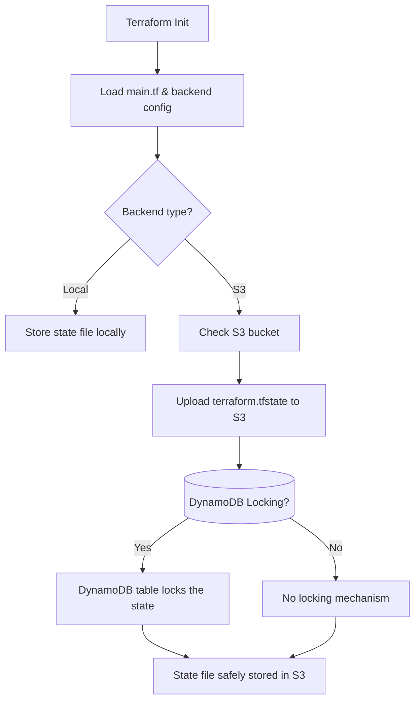

# 🌍 Terraform Project 01 — AWS VPC + EC2 Deployment (Remote State with S3)

## 🧠 Overview

This project provisions a **VPC**, **subnet**, and **EC2 instance** using **Terraform**.  
The Terraform state is stored remotely in **AWS S3**, ensuring centralized state management and version control.

---

## 🧰 Prerequisites

Before running this project:

- AWS account with programmatic access (Access Key + Secret Key)
- Terraform (v1.3.0+)
- AWS CLI configured locally
- S3 bucket for remote state storage

---

## 📂 Project Structure

```bash
terraform-projects/
└── 01-vpc-ec2-deployment/
    ├── provider.tf
    ├── variables.tf
    ├── main.tf
    ├── outputs.tf
    └── README.md
```
---
## ⚙️ Backend Configuration (Remote State in S3)
## 1️⃣ Create S3 Bucket for Terraform State
```bash
aws s3api create-bucket --bucket terraform-state-venkata --region us-east-1
```
<pre>
💡 Bucket name must be unique globally.
Example: terraform-state-venkata-1999
</pre>

## 2️⃣ (Optional) Enable Versioning on the Bucket
```bash
aws s3api put-bucket-versioning \
  --bucket terraform-state-venkata \
  --versioning-configuration Status=Enabled
```

## 3️⃣ Update provider.tf File
```
terraform {
  required_version = ">= 1.3.0"

  backend "s3" {
    bucket         = "terraform-state-venkata"     # Replace with your bucket name
    key            = "aws/vpc-ec2/terraform.tfstate"
    region         = "us-east-1"
    encrypt        = true
  }

  required_providers {
    aws = {
      source  = "hashicorp/aws"
      version = "~> 5.0"
    }
  }
}

provider "aws" {
  region = var.aws_region
}
```
---

## 💾 Optional: Enable State Locking with DynamoDB
To avoid conflicts when multiple users apply Terraform:

```bash
aws dynamodb create-table \
  --table-name terraform-locks \
  --attribute-definitions AttributeName=LockID,AttributeType=S \
  --key-schema AttributeName=LockID,KeyType=HASH \
  --billing-mode PAY_PER_REQUEST
```
Then add this line to your backend configuration:

```
dynamodb_table = "terraform-locks"
```
---
## 🚀 Usage

## 1️⃣ Initialize Terraform
```bash
terraform init
```
## 2️⃣ Plan the Infrastructure
```bash
terraform plan
```
## 3️⃣ Apply the Configuration
```bash
terraform apply -auto-approve
```
---
## 🧾 Outputs

After applying, Terraform will display:
<pre>
vpc_id = "vpc-xxxxxxxx"
subnet_id = "subnet-xxxxxxxx"
instance_id = "i-xxxxxxxx"
public_ip = "xx.xx.xx.xx"
</pre>
---
## 🧩 Terraform Workflow Overview



---

## 🧠 What You’ll Learn

<ul>
<li>How to define AWS resources (VPC, Subnet, EC2) with Terraform</li>
<li>How to use <b>variables, outputs,</b> and <b>providers</b> </li>
<li>How to <b>store Terraform state in S3</b> for team collaboration</li>
<li>How to <b>lock state with DynamoDB</b> (optional but recommended)</li>
<li>How to create <b>reusable infrastructure modules</b> in future projects</li>
</ul>

---

## 👨‍💻 Author

**Venkata Rami Reddy Bobbala**  
📧 [venkataramireddy1999@gmail.com](mailto:venkataramireddy1999@gmail.com)

🔗 [LinkedIn](https://www.linkedin.com/in/venkataramireddy-bobbala/)  
🐙 [GitHub](https://github.com/venkataramireddy1999)

⭐ *If you find this project useful, please give it a star and follow my weekly DevOps learning journey!*
